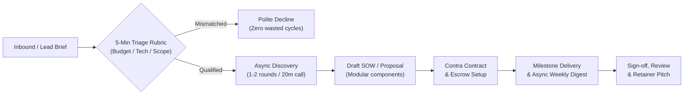

# GEMINI.md - Contra.com Consulting & Engineering Operations

## Mission & Identity

This repository governs the independent consulting, systems architecture, and engineering operations for **Rénich Bon Ćirić** on [Contra](https://contra.com).

### Core Positioning
- **Role**: Principal Infrastructure Architect, SRE/DevOps Lead, Systems Engineer.
- **Value Proposition**: High-leverage architecture, hardened Linux/container environments, zero-trust infrastructure, scalable CI/CD pipelines, and autonomous agent systems.
- **Engagement Model**: Productized services, fixed-scope architecture audits, and monthly/weekly fractional advisory retainers. Avoid race-to-the-bottom hourly commoditization.

---

## Operating Guidelines & Style

1. **Anti-Sycophancy & Direct Engineering**:
   - Scrutinize client requirements critically. Expose missing specs, unstated assumptions, and unrealistic timelines before contract signing.
   - Every proposal must define explicit **In-Scope** deliverables and unambiguous **Out-of-Scope** boundaries.
2. **Formatting Standard**:
   - **NEVER use spaces around forward slashes**. Always write `word/word` (e.g. `fixed-price/retainer`, `SRE/DevOps`, `Linux/Fedora`, `inbound/outbound`, `audit/assessment`).
3. **Memory & State Tracking (PJP)**:
   - Use `ajourn` (`pjp`) for all persistent project memory, state transitions, and architectural decisions.
   - Do NOT micro-log routine shell commands; log only knowledge deltas, client discoveries, and strategy decisions.

---

## Workspace Layout

```text
/home/renich/ai/contra/
├── GEMINI.md               # Project-level operating manual and wisdom store
├── services/               # Packaged service definitions, deliverables & pricing
├── case-studies/           # Portfolio case studies and technical postmortems
├── proposals/              # Proposal templates, intake rubrics, and SOW boilerplate
│   ├── intake-rubric.md    # Fast 5-minute lead qualification checklist
│   └── sow-template.md     # Modular scope of work template
├── clients/                # Per-client project tracking and contract dossiers
│   └── _template/          # Base skeleton for newly onboarded clients
└── scripts/                # Automation, scrapers, CLI helpers, and dispatch tools
```

---

## Operational Workflow



### 1. Lead Triage (< 5 Minutes)
- Match against tech stack (Linux/Fedora, containers, CI/CD, Go/Crystal/Bash, cloud/bare-metal, AI agents).
- Verify budget reality: reject undefined budgets or sub-market hourly requests.
- Filter out micromanagers or vague "build me an app" briefs lacking clear ownership.

### 2. Proposal & SOW Drafting
- Proposals live under `clients/<client-name>/proposal.md`.
- Always itemize:
  - **Context & Problem Statement**: What is broken or missing.
  - **Proposed Architecture / Solution**: High-level technical approach.
  - **Milestones & Deliverables**: Exact tangible artifacts (repos, configs, docs).
  - **Acceptance Criteria**: Verifiable tests/benchmarks for milestone payout.
  - **Explicitly Out of Scope**: Everything not explicitly listed.
  - **Prerequisites & Access**: What the client must deliver before work begins.

### 3. Execution & Delivery
- Work in git repos with conventional commits and clear changelogs.
- Provide weekly async status digests to client chat (eliminates synchronous meeting waste).
- Complete milestone -> Trigger review on Contra -> Await escrow release before proceeding to subsequent phase.

### 4. Closeout & Retainer Conversion
- Deliver final handover checklist and documentation.
- Request 5-star Contra review and public recommendation.
- Offer ongoing fractional advisory/maintenance retainer.

---

## Project Journaling Protocol (PJP)

- Cockpit check: `ajourn status`
- Log high-leverage decision: `ajourn log -m "DEC: <decision>" -t "DEC"`
- Log client discovery / gotcha: `ajourn log -m "GOT: <discovery>" -t "GOT"`
- Update state: `ajourn state set <key> <value>`
