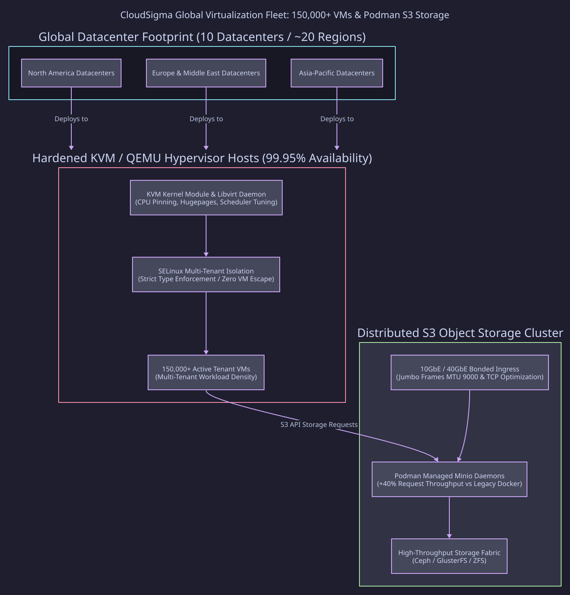

=================================================================
Global Virtualization Scaling to 150,000+ Tenant VMs & S3 Storage
=================================================================

:Role: Senior Systems Administrator & Infrastructure Deployment Engineer
:Client / Context: CloudSigma (Global Infrastructure-as-a-Service Provider)
:Timeline: Multi-Year Platform Engineering & Expansion
:Core Technologies: KVM/QEMU, Libvirt, Podman, Minio (S3), Ceph/GlusterFS, SELinux, Puppet, Linux Kernel Networking

Challenge & Problem Statement
=============================

As an international IaaS cloud provider with footprints across North America, Europe, the Middle East, and Asia-Pacific, CloudSigma faced rapid tenant growth. The infrastructure needed to scale reliably across 10+ core datacenters without compromising multi-tenant hypervisor isolation, storage I/O performance, or platform availability.

Key imperatives included:

* Scaling hypervisor density without tenant noisy-neighbor starvation.
* Modernizing distributed object storage infrastructure to support petabyte-scale throughput.
* Enforcing defense-in-depth isolation across shared virtualization hosts.

Architectural Solution & Strategy
=================================

Hypervisor Fleet Engineering (KVM/QEMU & Libvirt)
-------------------------------------------------

Scaled the core virtualization foundation to support **150,000+ tenant VMs globally**. Tuned Linux kernel scheduler, hugepages, and KVM CPU pinning for consistent compute latencies.

High-Performance Object Storage Modernization
---------------------------------------------

Led the deployment and operational scaling of Minio S3-compatible object storage clusters. Replaced legacy container runtime patterns with lightweight, secure container engines (Podman), improving object storage throughput by **40%**.

Automated Bare-Metal Deployment & Hardening
-------------------------------------------

Engineered zero-touch automated rack provisioning using PXE/iPXE and declarative configuration management. Enforced strict SELinux policies across hypervisor hosts, safeguarding multi-tenant hypervisor boundaries against VM escape vulnerabilities.

Implementation Highlights
=========================

* Architected automated health monitoring and live-migration triggers for host maintenance with zero customer VM disruption.
* Solved complex network saturation bottlenecks through 10GbE/40GbE link aggregation, MTU tuning (Jumbo Frames), and kernel TCP optimization.
* Authored production runbooks and standard operating procedures (SOPs) enabling global follow-the-sun support teams to resolve tier-3 escalations swiftly.

Verifiable Results & Business Impact
====================================

* **Platform Scale**: Supported **150,000+ tenant virtual machines** across **10 global datacenters**.
* **High Availability**: Maintained **99.95% platform uptime** throughout years of rapid international expansion.
* **Storage Throughput**: Boosted S3 object storage read/write performance by **40%**.
* **Security Rigor**: Zero hypervisor cross-tenant breaches; fully audited and hardened Linux host environment.
