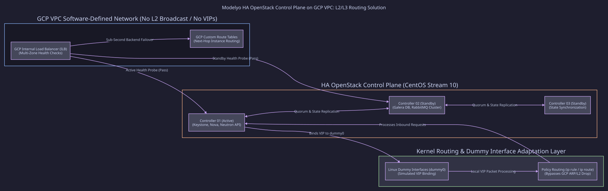

==================================================================
High-Availability OpenStack Control Plane on Google Cloud Platform
==================================================================

:Role: Lead Cloud Infrastructure Consultant
:Client / Context: Modelyo
:Timeline: Under 3 weeks (Solo Engineering Sprint)
:Core Technologies: OpenStack, Google Cloud Platform (GCP VPC), OpenTofu, CentOS Stream 10, Advanced Linux Routing

Challenge & Problem Statement
=============================

Modelyo required an enterprise-grade, High-Availability (HA) OpenStack control plane deployed directly inside Google Cloud Platform (GCP) to drive specialized private cloud workloads and dynamic orchestration.

However, nesting OpenStack within GCP introduces severe architectural impediments:

* GCP's Software-Defined Networking (SDN) VPC does not natively support Layer-2 broadcast, ARP, or standard Virtual IP (VIP) failover protocols (e.g. Keepalived/VRRP) required by standard OpenStack HA control planes.
* Previous internal estimates called for a multi-engineer team working 3 to 4 months to resolve the network impedance mismatch and deploy the stack.

Architectural Solution & Strategy
=================================

L2/L3 Network Impedance Resolution
----------------------------------

Overcame GCP VPC constraints without costly third-party overlays by designing a resilient routing architecture using Linux dummy interfaces, advanced IP route policies (``ip rule``/``ip route``), and GCP Internal HTTP(S) & TCP Load Balancers with multi-region health checks.

Declarative IaC with OpenTofu
-----------------------------

Re-architected deployment from legacy Terraform to modular OpenTofu, enforcing strict parameterization, state locking, and reproducible provisioning across test and production environments.

CentOS Stream 10 Baseline
-------------------------

Standardized control plane nodes on CentOS Stream 10, implementing hardened systemd unit supervision and immutable configuration files.

Implementation Highlights
=========================

* Engineered automated health-check probes coordinating with GCP regional backends to achieve sub-second failover between OpenStack API services.
* Containerized OpenStack control plane services with rootless isolation, optimizing CPU/memory footprint across GCP compute instances.
* Completed full architectural delivery as a solo engineer in under 21 calendar days.

Verifiable Results & Business Impact
====================================

* **Financial Efficiency**: Generated **$80,000+ in engineering resource savings** by eliminating the need for an external consulting agency team.
* **Rapid Time-to-Market**: Control plane fully operational and validated in **under 3 weeks**.
* **High Availability**: Passed simulated multi-zone outage tests with automated failover and zero control plane data corruption.
