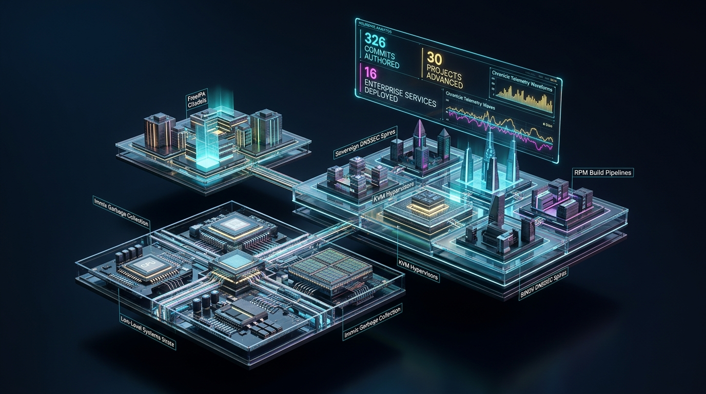

========================================================================
Weekly Engineering Dispatch: 326 Commits, Microkernels & Sovereign Cloud
========================================================================

:Author: René Bon Ćirić (Rénich)
:Date: 2026-09-19
:Scope: Week 38, September 2026
:Telemetry Source: Chronicle Local Telemetry Daemon
:Metrics: 326 commits authored, 30 repositories advanced, 16 enterprise services published

Executive Summary
=================

Real engineering velocity is measured not in Jira tickets or status meetings, but in tested commits, hardened invariants, and production-ready architectures shipped to the wild.

According to telemetry recorded by our local ``chronicle`` daemon, this week spanned **326 git commits authored across 30 distinct repositories**. The work ranged from bare-metal microkernel substrates and actor concurrency models to FOSS language tooling (Crystal v1.21.0), distributed storage, and the complete institutional packaging of our enterprise infrastructure consulting operations on Contra.

Here is what went down in the trenches this week.

1. Deep-Stack Systems & Microkernel Engineering (``micros``)
============================================================

The primary technical focus was the continued architectural hardening of the ``micros`` microkernel substrate, logging **159 commits** across 24 consecutive audit-and-remediation cycles using Gemini DeepThink:

* **Substrate & Kernel Invariants**: Enforced strict ``W^X`` (Write XOR Execute) memory protections, hardened UEFI Physical Memory Manager (PMM) reservations, and resolved NVMe MMIO register bounds.
* **Actor Concurrency & Garbage Collection**: Wired Immix GC cycle tracing directly into actor lifecycles, partitioned SMP Task State Segments (TSS) and syscall execution contexts, and eliminated use-after-free conditions in actor release gates.
* **Network & Bare-Metal Protocols**: Hardened TCP state machines against sequence desynchronization, implemented automated packet retransmission on dropped FIN segments, and eliminated struct copy mutations in zero-copy TLS client state machines.

2. Open Source Ecosystem & Language Tooling
===========================================

* **``crinit`` v0.1.0 Release**: Shipped our modern, declarative Crystal project initializer with hardened protections against directory path traversal, symlink escapes, and SSRF. Published Echelon Protocol audit reports and opened Crystal Forum RFC topic `#9156`.
* **Crystal v1.21.0 Modernization**: Upgraded our internal toolchains, shards, and skills to align with the latest Crystal v1.21.0 compiler release, standardizing on modern Execution Contexts for multi-threading and updating shard lock file document structures.
* **``shellmin`` & Workload Modules**: Codified a strict zero-JVM/zero-Node.js runtime invariant for lightweight infrastructure nodes, implemented idempotent base modules across Fedora and CentOS Stream 10, and added Vitastor distributed block storage to our roadmap.

3. Institutional Infrastructure Consulting on Contra
====================================================

Beyond lower-level systems code, we finalized the packaging of our independent consulting presence on Contra.com, moving away from low-ticket script sales toward high-leverage, productized enterprise engineering:

* **16 Productized Services Published**: Packaged fixed-scope engineering sprints ($3,000 – $6,500) and fractional advisory retainers ($2,000/week) covering Sovereign KVM/Ceph Virtualization, FreeIPA HA & PKI, Custom Immutable Linux Distributions (mkosi/UKI), High-Availability Ingress (HAProxy/Caddy), Core Network Infrastructure (BIND9/Kea/Chrony), and Sovereign Enterprise Mail (exu).
* **4 Flagship Case Studies**: Published comprehensive technical postmortems detailing the ADIP 4,500-instance OpenShift migration, CloudSigma 150k+ VM global hypervisor scaling, AdvantageMLS $45k/yr GCP cost optimization, and Modelyo HA OpenStack control planes.
* **3D Isometric Systems Art**: Designed and generated 16+ OctaneRender-style 3D isometric architecture banners on obsidian backdrops, establishing a cohesive visual identity matching institutional engineering standards.
* **Self-Healing MCP Automation**: Authored a custom Python/Bash CLI coordinating with Contra's Model Context Protocol (MCP) server, featuring automated RFC 6749 OAuth token refresh and strict prepare-and-confirm safety validation.

Looking Ahead
=============

True sovereignty in technology requires mastery across every layer of the stack: from the physical memory registers and microkernel scheduler to the DNSSEC keys, container runtimes, and cloud topologies.

Next week: putting the newly packaged infrastructure services through client discovery and continuing substrate verification.
